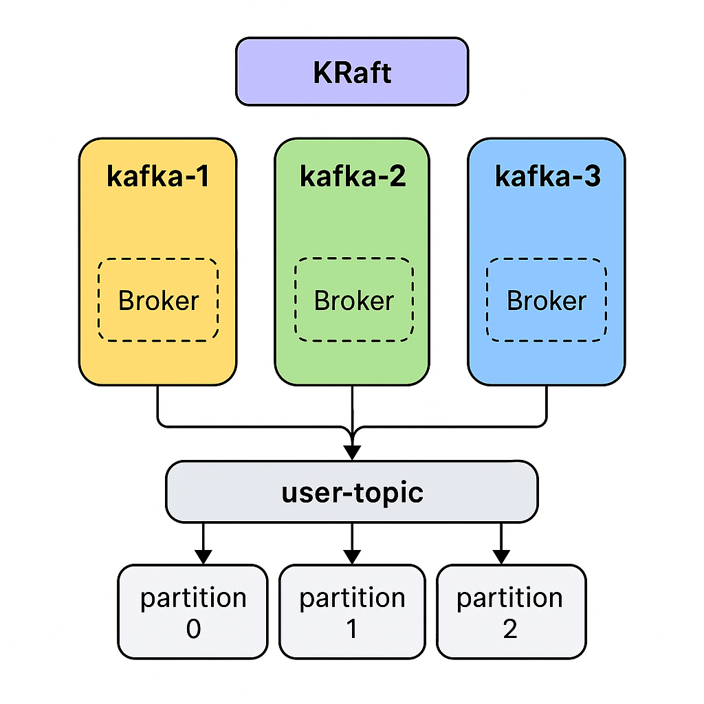

# Docker Compose для запуска Kafka:

```shell
version: '3.8'

services:
  kafka:
    image: bitnami/kafka:3.7.0
    container_name: kafka
    ports:
      - "9092:9092"   # для приложений
      - "9094:9094"   # для внешнего доступа
    environment:
      # Основные настройки KRaft
      KAFKA_CFG_NODE_ID: 1
      KAFKA_CFG_PROCESS_ROLES: broker,controller
      KAFKA_CFG_CONTROLLER_QUORUM_VOTERS: 1@kafka:9093
      KAFKA_CFG_LISTENERS: PLAINTEXT://:9092,CONTROLLER://:9093,PLAINTEXT_HOST://:9094
      KAFKA_CFG_ADVERTISED_LISTENERS: PLAINTEXT://kafka:9092,PLAINTEXT_HOST://localhost:9094
      KAFKA_CFG_LISTENER_SECURITY_PROTOCOL_MAP: PLAINTEXT:PLAINTEXT,CONTROLLER:PLAINTEXT,PLAINTEXT_HOST:PLAINTEXT
      KAFKA_CFG_CONTROLLER_LISTENER_NAMES: CONTROLLER
      KAFKA_CFG_INTER_BROKER_LISTENER_NAME: PLAINTEXT
      ALLOW_PLAINTEXT_LISTENER: "yes"
      KAFKA_CFG_AUTO_CREATE_TOPICS_ENABLE: "true"
      KAFKA_CFG_NUM_PARTITIONS: 3
    volumes:
      - kafka-data:/bitnami/kafka

  kafka-ui:
    image: provectuslabs/kafka-ui:latest
    container_name: kafka-ui
    ports:
      - "8080:8080"
    environment:
      KAFKA_CLUSTERS_0_NAME: local
      KAFKA_CLUSTERS_0_BOOTSTRAPSERVERS: kafka:9092
      KAFKA_CLUSTERS_0_ZOOKEEPER: ""  # Для KRaft не нужен Zookeeper
    depends_on:
      - kafka

volumes:
  kafka-data:


# KRaft:
# Используем Bitnami Kafka (без Zookeeper).
# Настроены PROCESS_ROLES → broker,controller (Kafka в режиме KRaft).
# Контроллер слушает на 9093.
# Брокер слушает на 9092 (для приложений) и 9094 (для доступа с хоста).
#
# Kafka UI:
# Provectus Kafka UI на порту 8080.
# Подключается напрямую к kafka:9092 (в Docker-сети).
#
# Автосоздание топиков:
# KAFKA_CFG_AUTO_CREATE_TOPICS_ENABLE=true
# KAFKA_CFG_NUM_PARTITIONS=3 (дефолт для новых топиков).

# Kafka доступна на localhost:9094 (для сервисов).
#Kafka UI → http://localhost:8080
```

# Пояснение

## Что такое **KRaft**?

Раньше Kafka использовала **Zookeeper** для хранения метаданных кластера (
топики, партиции, контроллеры).
Но с версии **3.3+** появился режим **KRaft (Kafka Raft)**, где **Zookeeper
убрали**, а Kafka сама управляет метаданными.

### **Как работает KRaft?**

* В кластере есть **контроллеры** (controller) → отвечают за метаданные: топики,
  ACL, лидеры партиций.
* Есть **брокеры** (broker) → хранят данные (партиции) и принимают запросы от
  продюсеров/консьюмеров.
* Контроллеры используют **Raft consensus protocol** (отсюда название **KRaft
  **), чтобы договориться, кто лидер.

## ✅ Роли: **broker** и **controller**

* **Broker** – обычный брокер Kafka: принимает сообщения, пишет их на диск,
  отдаёт консьюмерам.
* **Controller** – узел, управляющий метаданными (вместо Zookeeper).
* В **KRaft** один и тот же сервер может быть и **broker**, и **controller** (
  как в твоём примере).
* В продакшене обычно **минимум 3 контроллера** (для кворума), но в dev можно
  один.

---

## ✅ Почему разные порты?

Kafka запускает **несколько listeners** для разных целей:

| Listener                 | Назначение                                              |
|--------------------------|---------------------------------------------------------|
| `PLAINTEXT://:9092`      | Основной listener для внутренних сервисов в сети Docker |
| `CONTROLLER://:9093`     | Канал для контроллеров (метаданные)                     |
| `PLAINTEXT_HOST://:9094` | Для подключения **с хоста** (localhost)                 |

**Почему нельзя один порт?**
Потому что:

* Контроллеры общаются по отдельному протоколу (Raft) → нужен `9093`.
* Клиенты внутри Docker подключаются к `kafka:9092`.
* Клиенты на хосте (твои сервисы на машине) → `localhost:9094`.

**Advertised listeners** решают проблему:

* Внутри сети Docker → `kafka:9092`
* Снаружи (с твоего ноутбука) → `localhost:9094`

---

## ✅ Сколько нужно брокеров и контроллеров?

* **DEV/LOCAL** → 1 узел (broker+controller) хватает.
* **PROD**:

    * **3 контроллера** (для отказоустойчивости метаданных).
    * **3+ брокера** (для данных, replication factor ≥ 3).

---

## ✅ Важно:

* KRaft полностью убирает Zookeeper.
* Метаданные теперь хранятся прямо в Kafka.
* Все узлы (контроллеры) используют **Raft** для консенсуса.

---

# В docker-compose кластер из 3 брокеров и 3 контроллеров (KRaft). Как создаётся топик с 3 партициями и replication factor 3 в этом режиме?

Отлично, объясняю оба пункта сразу:

---

## ✅ 1. **Как сделать кластер Kafka в KRaft режиме (3 брокера + 3 контроллера) в

Docker Compose**

В KRaft можно объединить **broker** и **controller** на одном узле (для
упрощения), но для отказоустойчивости делаем 3 отдельных контейнера.

### **Пример docker-compose.yml**

[docker-compose-2.yml](../../files/docker-compose-2.yml)

### **Что важно в этом compose:**

* **KAFKA\_NODE\_ID** – уникальный ID узла.
* **KAFKA\_PROCESS\_ROLES=broker,controller** – каждый узел и брокер, и
  контроллер.
* **KAFKA\_CONTROLLER\_QUORUM\_VOTERS** – список всех контроллеров с их портами
  `9093`.
* **KAFKA\_LISTENERS**:

    * `PLAINTEXT://:9092` – для клиентов (продюсеров/консьюмеров).
    * `CONTROLLER://:9093` – для Raft-кворума.
* **KAFKA\_ADVERTISED\_LISTENERS** – как брокер виден другим узлам.
* **KAFKA\_CLUSTER\_ID** – общий идентификатор кластера (один для всех).

📌 Для UI (например, **Kafdrop**) добавь сервис:

```yaml
  kafdrop:
    image: obsidiandynamics/kafdrop
    ports:
      - "9000:9000"
    environment:
      KAFKA_BROKERCONNECT: "kafka-1:9092,kafka-2:9092,kafka-3:9092"
```

---

## ✅ 2. **Как создать топик с 3 партициями и replication factor = 3**

Когда у тебя есть 3 брокера, можно создать топик с репликацией:

```bash
docker exec -it kafka-1 kafka-topics --create \
  --topic user-topic \
  --partitions 3 \
  --replication-factor 3 \
  --bootstrap-server kafka-1:9092
```

### Что это значит:

* **--partitions 3** → 3 партиции → можно читать параллельно из 3 консьюмеров
  одной группы.
* **--replication-factor 3** → каждый брокер хранит копию всех данных (повышает
  отказоустойчивость).
* **Лидер** партиции будет на одном брокере, **фолловеры** на двух других.

---

### ✅ Почему важно replication factor?

* Если replication factor = 1 → потеряешь данные при падении брокера.
* replication factor = 3 → можешь потерять 2 брокера и всё равно не потеряешь
  данные.

---

## Схема кластера Kafka с KRaft, брокерами, контроллерами и топиком с 3 партициями и репликацией**



## Как указать партиции и репликацию прямо в application.yml Spring Boot

В Spring Boot для Kafka можно указать количество партиций и фактор репликации
прямо в `application.yml`, но важно понимать:

* Эти параметры работают **только при автоматическом создании топика** (если
  включен `auto-create-topics`).
* Для этого используется `spring.kafka.admin` и класс `NewTopic` через бин.

Пример конфигурации в `application.yml`:

```yaml
spring:
  kafka:
    bootstrap-servers: localhost:9092
    admin:
      properties:
        # Включает KafkaAdmin для создания топиков
        bootstrap.servers: localhost:9092
    topic:
      name: user-topic
      partitions: 3
      replication-factor: 1
```

### Как это применить в коде:

Создай бин, который прочитает настройки и создаст топик:

```kotlin
import org.apache.kafka.clients.admin.NewTopic
import org.springframework.context.annotation.Bean
import org.springframework.context.annotation.Configuration
import org.springframework.beans.factory.annotation.Value

@Configuration
class KafkaTopicConfig(
    @Value("\${spring.kafka.topic.name}") private val topicName: String,
    @Value("\${spring.kafka.topic.partitions}") private val partitions: Int,
    @Value("\${spring.kafka.topic.replication-factor}") private val replicationFactor: Short
) {
    @Bean
    fun topic(): NewTopic {
        return NewTopic(topicName, partitions, replicationFactor)
    }
}
```

---

✅ Таким образом:

* Настройки (имя топика, партиции, репликация) находятся в **application.yml**.
* Spring Boot при старте создаст топик через `KafkaAdmin`.
* Работает только если Kafka разрешает автосоздание топиков или если
  `KafkaAdmin` имеет права создавать топики.

